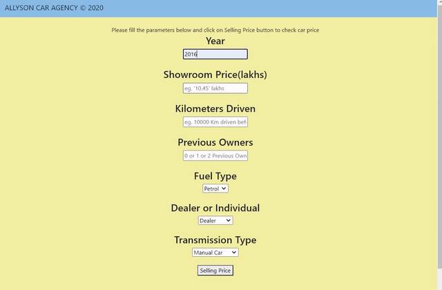

# Car-Price-Prediction

  

This repository consists of files required for end to end implementation and deployment of Machine Learning Car Price Prediction web application created with Flask and deployed on AWS Beanstalk.

## Table of Contents
  * [App Link](#app-link)
  * [About the App](#about-the-app)
  * [Technologies Used](#technologies-used)
  * [Dockerhub)(#dockerhub)


## App Link
If you want to view the deployed model, click on the following link:<br />
[http://project2-env.eba-tw7mvppa.ap-south-1.elasticbeanstalk.com]([https://allysoncaragency.herokuapp.com/](http://http://project2-env.eba-tw7mvppa.ap-south-1.elasticbeanstalk.com))

A glimpse of the web app:




## About the App
The Car Price Prediction is a flask web application which predicts car prices based on given independent features like Car_Name,	Year,	Selling_Price,	Present_Price,	Kms_Driven,	Fuel_Type,	Seller_Type,	Transmission, and Owner. The dataset is available at Kaggle, and it's provided by cardekho.com. 

The code is written in Python 3.6.10. If you don't have Python installed, you can find it [here](https://www.python.org/downloads/). If you are using a lower version of Python you can upgrade using the pip package, ensuring you have the latest version of pip. To install the required packages and libraries, run this command in the project directory after [cloning](https://www.howtogeek.com/451360/how-to-clone-a-github-repository/) the repository:
```bash
pip install -r requirements.txt
python -m app.py
```
## Dockerhub
Image of this Web Application is uploaded on my Github repository.
<br />Please use this link to access the image: https://hub.docker.com/r/gprabhakara/wcd_project3/tags
<br />Please use this command to pull this image: docker pull gprabhakara/wcd_project3:car-rental-webapp
<br />Once the image is downloaded. Please use Docker run and please specify the ports (i.e docker run -d -p ports:ports <Image ID>). Once the image is ran webapp will be hosted on your local host on the specified port. To view the webapp visit http://localhost:port

## Technologies Used


[](https://flask.palletsprojects.com/en/1.1.x/) [](https://gunicorn.org) [](https://scikit-learn.org/stable/) 

